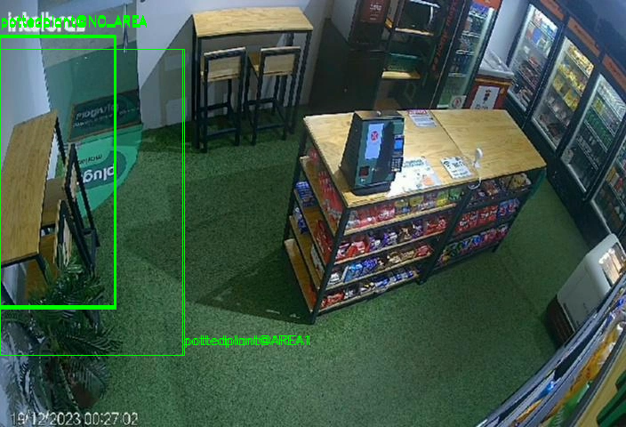
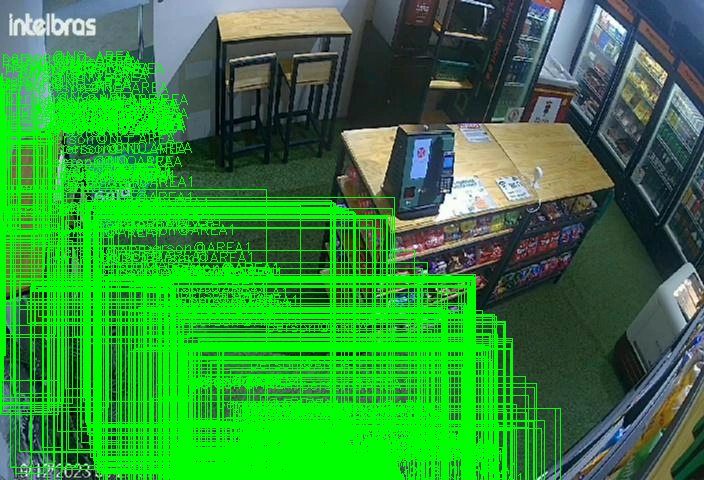

# 1. NLD :: Image Analysis API :: Utilizaçãod da API [WiP]

## 1.1. TOC

- [1. NLD :: Image Analysis API :: Utilizaçãod da API \[WiP\]](#1-nld--image-analysis-api--utilizaçãod-da-api-wip)
  - [1.1. TOC](#11-toc)
  - [1.2. Preliminares](#12-preliminares)
  - [1.3. Casos de uso \[WiP\]](#13-casos-de-uso-wip)
    - [1.3.1. UC1 - Geração de bounding boxes na imagem de teste](#131-uc1---geração-de-bounding-boxes-na-imagem-de-teste)
      - [1.3.1.1. Encadeamento lógico](#1311-encadeamento-lógico)
      - [1.3.1.2. Estrutura da requisição](#1312-estrutura-da-requisição)
      - [1.3.1.3. Estruturas das respostas](#1313-estruturas-das-respostas)
  - [1.4. O que deseja fazer?](#14-o-que-deseja-fazer)

## 1.2. Preliminares

> [!IMPORTANT]
> - A documentação da API RESTful é acessível pelo endereço [`http://localhost:8001/api/docs`](http://localhost:8001/api/docs), via browser, após o container do web service ter sido devidamente iniciado;
> - Para efeitos de teste, existem criadas uma collection e environment no Postman. Os arquivos podem ser importados e se encontram na pasta `resources/testing`.

## 1.3. Casos de uso [WiP]

### 1.3.1. UC1 - Geração de bounding boxes na imagem de teste

#### 1.3.1.1. Encadeamento lógico

- A1: Os IDs para os arquivos JSON e PNG, assim como o nome do objeto e o tipo de análise (neste caso)Gather params from incoming payload;
- A2: De posse desses parâmetros, o web service então realiza o download dos arquivos de entrada (JSON e PNG), em um diretório no qual um volume foi criado, em comunicação como o container do web service;
- A3: Com o conteúdo do JSON carregado, o web service extrai as informações de rastramento de objetos do atributo `deepstream-msg`, e realiza um parsing adequado a cada elemento da lista, de modo que cada elemento esteja apto a ser persistido no banco de dados relacional e também para que a geração das bounding boxes na imagem original seja feita com mais facilidade;
- A4: As bounding boxes são superpostas à imagem original e um novo arquivo PNG é gerado, tendo o nome construído segundo o padrão `{id_da_imagem_oriingal}_bb_{nome_do_objeto)_{YYYY-MM-DD_HH-MM-SS}.png_`
- A5: Os elementos parseados da lista de rastreamento do objeto são salvos no banco de dados e uma resposta é gerada pela API RESTful.

#### 1.3.1.2. Estrutura da requisição
- Método: POST
- Endpoint: `api/v1/img_analysis`
- Schema para o body da requisição: No caso aqui, os IDs em questão estão associados aos arquivos compartilhados no documento do [Google Drive](https://docs.google.com/document/d/1vlUl3kT_IvQnEPcc83xS4viUIi7edclA55qUXOlFD3g/edit?tab=t.0):

```json
{
    "json_file_google_drive_id": "1_rgKrCgHvnfYfg3jD0bpMK9eIB5Dymjy",
    "image_file_google_drive_id": "1GXHYrpLb6nyO1tryCXrz2twNPqU3yH3B",
    "object_label": "pottedplany",
    "analysis_type": "bounding-box"
}
```

#### 1.3.1.3. Estruturas das respostas

- **Resposta de API**: Retorna um status HTTP 201 (CREATED) lista onde cada mensagem parseada, oriunda de `deepstream-msg` (JSON de entrada), foi cadastrada no banco de dados:
```json
{
    "status": 201,
    "data": {
        "analysis": [
            {
                "id": "4ff65585-ebda-4c06-a917-48351ca1ed85",
                "tracking_id": 546,
                "x_min_bb": 0.0,
                "y_min_bb": 40.9198,
                "x_max_bb": 130.48,
                "y_max_bb": 347.899,
                "x_centroid_bb": 65.24,
                "y_centroid_bb": 194.4094,
                "object_label": "pottedplant",
                "region_label": "NO_AREA",
                "image_path": "img_analysis_data/input/images/1GXHYrpLb6nyO1tryCXrz2twNPqU3yH3B.png",
                "analysis_type": "bounding-box"
            },
            {
                "id": "6766998b-8aa5-4898-a554-87eb5a783d4b",
                "tracking_id": 546,
                "x_min_bb": 0.0,
                "y_min_bb": 41.0655,
                "x_max_bb": 130.371,
                "y_max_bb": 347.489,
                "x_centroid_bb": 65.1855,
                "y_centroid_bb": 194.27724999999998,
                "object_label": "pottedplant",
                "region_label": "NO_AREA",
                "image_path": "img_analysis_data/input/images/1GXHYrpLb6nyO1tryCXrz2twNPqU3yH3B.png",
                "analysis_type": "bounding-box"
            },
            ...        
        ]
    }
}
```
- **Arquivos gerados**: A aplicação FastAPI possui um volume associado à pasta `img_analysis_data`, no qual os arquivos de entrada (oriundos dos downloads) e de saíða (oriundos da análise via API) são salvos. A estrutura de pastas é a seguinte:
```bash
img_analysis_data/                                      # Onde é feita o bind com o volume. Deve ser criado manualmente
├── input
│   ├── elasticsearch                                   # Onde é salvo o JSON. Criado automaticamente
│   │   └── 1_rgKrCgHvnfYfg3jD0bpMK9eIB5Dymjy.json
│   └── images                                          # Onde é salvo o PNG. Criado automaticamente
│       └── 1GXHYrpLb6nyO1tryCXrz2twNPqU3yH3B.png
└── output
    └── bounding-box                                    # Onde são salvos os PNGs com bounding boxes Criado automaticamente
        ├── 1GXHYrpLb6nyO1tryCXrz2twNPqU3yH3B_bb_chair_2025-07-07_08-41-42.png              # Objeto "chair"
        ├── 1GXHYrpLb6nyO1tryCXrz2twNPqU3yH3B_bb_pottedplant_2025-07-07_07-37-53.png        # Objeto "pottedplant"
        └── ...
```

Para efeito de ilustração, segue abaixo segue a imagem gerada com a label `1GXHYrpLb6nyO1tryCXrz2twNPqU3yH3B_bb_pottedplant_2025-07-07_07-37-53.png`:





Idem para imagem gerada com a label `1GXHYrpLb6nyO1tryCXrz2twNPqU3yH3B_bb_person_2025-07-07_09-22-55.png`:





## 1.4. O que deseja fazer?

- [Voltar para TOC](#11-toc)
- [Voltar para a documentação principal](./README.md)
