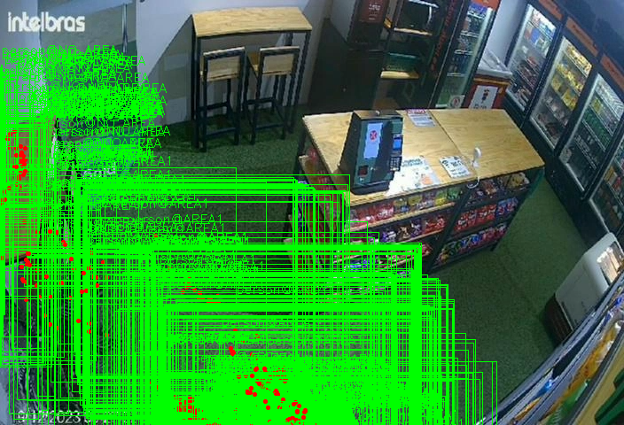
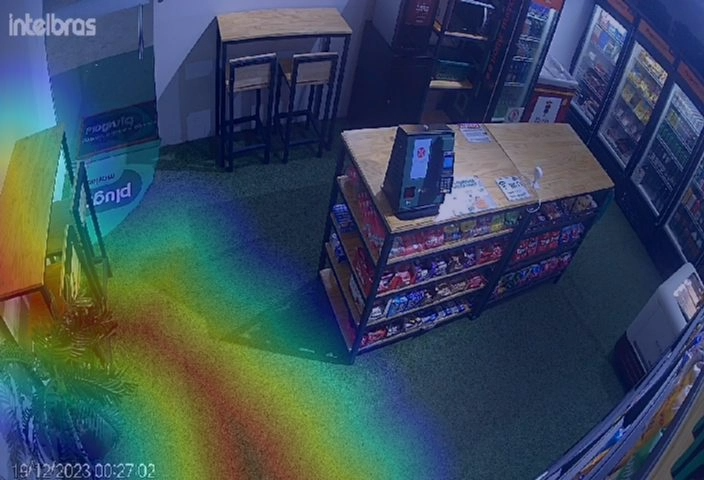

# 1. NLD :: Image Analysis API :: Utilização da API [WiP]

## 1.1. TOC

- [1. NLD :: Image Analysis API :: Utilização da API \[WiP\]](#1-nld--image-analysis-api--utilização-da-api-wip)
  - [1.1. TOC](#11-toc)
  - [1.2. Preliminares](#12-preliminares)
  - [1.3. Casos de uso \[WiP\]](#13-casos-de-uso-wip)
    - [1.3.1. UC1 - Geração de caixas visuais delimitadoras (bounding boxes) em imagens](#131-uc1---geração-de-caixas-visuais-delimitadoras-bounding-boxes-em-imagens)
      - [1.3.1.1. Encadeamento lógico](#1311-encadeamento-lógico)
      - [1.3.1.2. Estrutura da requisição](#1312-estrutura-da-requisição)
      - [1.3.1.3. Estrutura da resposta](#1313-estrutura-da-resposta)
    - [1.3.2. UC2 - Geração de mapas de calor (heat maps) em imagens](#132-uc2---geração-de-mapas-de-calor-heat-maps-em-imagens)
      - [1.3.2.1. Encadeamento lógico](#1321-encadeamento-lógico)
      - [1.3.2.2. Estrutura da requisição](#1322-estrutura-da-requisição)
      - [1.3.2.3. Estrutura da resposta](#1323-estrutura-da-resposta)
    - [1.3.3. Arquivos gerados](#133-arquivos-gerados)
  - [1.4. O que deseja fazer?](#14-o-que-deseja-fazer)

## 1.2. Preliminares

> [!IMPORTANT]
> - A documentação da API RESTful é acessível pelo endereço [`http://localhost:8001/api/docs`](http://localhost:8001/api/docs), via browser, após o container do web service ter sido devidamente iniciado;
> - Para efeitos de teste, existem criadas uma collection e environment no Postman. Os arquivos podem ser importados e se encontram na pasta `resources/testing`.

## 1.3. Casos de uso [WiP]

### 1.3.1. UC1 - Geração de caixas visuais delimitadoras (bounding boxes) em imagens

#### 1.3.1.1. Encadeamento lógico

- A1: Os IDs para os arquivos JSON e PNG, assim como o nome do objeto e o tipo de análise (neste caso)Gather params from incoming payload;
- A2: De posse desses parâmetros, o web service então realiza o download dos arquivos de entrada (JSON e PNG), em um diretório no qual um volume foi criado, em comunicação como o container do web service;
- A3: Com o conteúdo do JSON carregado, o web service extrai as informações de rastramento de objetos do atributo `deepstream-msg`, e realiza um parsing adequado a cada elemento da lista, de modo que cada elemento esteja apto a ser persistido no banco de dados relacional e também para que a geração das bounding boxes na imagem original seja feita com mais facilidade;
- A4: As bounding boxes são superpostas à imagem original e um novo arquivo PNG é gerado, tendo o nome construído segundo o padrão `bounding-box_{nome_do_objeto)_{id-do-arquivo}.png`
- A5: Os elementos parseados da lista de rastreamento do objeto são salvos no banco de dados e uma resposta é gerada pela API RESTful.

#### 1.3.1.2. Estrutura da requisição
- **Método**: POST
- **Endpoint**: `api/v1/img_analysis`
- **Schema para o body da requisição**: No caso aqui, os IDs em questão estão associados aos arquivos compartilhados no documento do [Google Drive](https://docs.google.com/document/d/1vlUl3kT_IvQnEPcc83xS4viUIi7edclA55qUXOlFD3g/edit?tab=t.0):

```json
{
    "json_file_google_drive_id": "1_rgKrCgHvnfYfg3jD0bpMK9eIB5Dymjy",
    "image_file_google_drive_id": "1GXHYrpLb6nyO1tryCXrz2twNPqU3yH3B",
    "object_label": "person",
    "analysis_type": "bounding-box"
}
```

#### 1.3.1.3. Estrutura da resposta

- **Resposta de API**: Retorna um status HTTP 201 (CREATED) lista onde cada mensagem parseada, oriunda de `deepstream-msg` (JSON de entrada), foi cadastrada no banco de dados:
```json
{
    "status": 201,
    "data": {
        "analysis": [
            {
                "id": "ea132563-de75-4ad3-8a59-ca16ee1d9083",
                "tracking_id": 588,
                "x_min_bb": 289.277,
                "y_min_bb": 531.153,
                "x_max_bb": 235.184,
                "y_max_bb": 475.834,
                "x_centroid_bb": 262.2305,
                "y_centroid_bb": 503.4935,
                "object_label": "person",
                "region_label": "AREA1",
                "image_path": "img_analysis_data/output/bounding-box/bounding-box_person_1GXHYrpLb6nyO1tryCXrz2twNPqU3yH3B.png",
                "analysis_type": "bounding-box"
            },
            ...        
        ]
    }
}
```

###  1.3.2. UC2 - Geração de mapas de calor (heat maps) em imagens

#### 1.3.2.1. Encadeamento lógico

Similar ao caso de uso UC1. Apenas chamo a atenção para a ação A4, que se diferencia do caso de uso original:

- A4: Para cada mensagem de rastreamento, o mapa de calor é gerado baseado na evolução do centróide da bounding box ao longo da imagem. Com o mapa de calor gerado, o mesmo é exportado em um novo arquivo PNG, tendo o nome construído segundo o padrão `heat-map_{nome_do_objeto)_{id-do-arquivo}.png`


#### 1.3.2.2. Estrutura da requisição
- **Método**: `POST`
- **Endpoint**: `/api/v1/img_analysis`
- **Schema para o body da requisição**: O único atributo que sofre alteração no seu valor é o `analysis_type`, que agora recebe `heat-map`:

```json
{
    "json_file_google_drive_id": "1_rgKrCgHvnfYfg3jD0bpMK9eIB5Dymjy",
    "image_file_google_drive_id": "1GXHYrpLb6nyO1tryCXrz2twNPqU3yH3B",
    "object_label": "person",
    "analysis_type": "heat-map"
}
```

#### 1.3.2.3. Estrutura da resposta

- **Resposta de API**: Similar à resposta em UC1, com os elementos diferenciando-se no `id`, `image_path` e `analysis_type`:
```json
{
    "status": 201,
    "data": {
        "analysis": [
             {
                "id": "482c52c7-72e8-473f-8173-774869a6bc07",
                ...
                "image_path": "img_analysis_data/output/heat-map/heat-map_person_1GXHYrpLb6nyO1tryCXrz2twNPqU3yH3B.png",
                "analysis_type": "heat-map"
            },
            ...        
        ]
    }
}
```

### 1.3.3. Arquivos gerados
 
 A aplicação FastAPI possui um volume associado à pasta `img_analysis_data`, no qual os arquivos de entrada (oriundos dos downloads) e de saíða (oriundos da análise via API) são salvos. A estrutura de pastas é a seguinte:
```bash
img_analysis_data/                                                             # Onde é feito a associação com o volume do container do webservice
├── input
│   ├── elasticsearch                                                          # Onde é salvo o JSON de entrada
│   │   └── 1_rgKrCgHvnfYfg3jD0bpMK9eIB5Dymjy.json
│   └── images                                                                 # Onde é salvo o PNG de entrada
│       └── 1GXHYrpLb6nyO1tryCXrz2twNPqU3yH3B.png
└── output
    └── bounding-box                                                           # Onde são salvos os PNGs com bounding boxes
    │   ├── bounding-box_person_1GXHYrpLb6nyO1tryCXrz2twNPqU3yH3B.png          # Bounding boxes para o objeto "person"
    │   └── ...
    └── heat-map                                                               # Onde são salvos os PNGs com mapas de calor
        ├── heat-map_person_1GXHYrpLb6nyO1tryCXrz2twNPqU3yH3B.png              # Mapa de calor para o objeto "person"
        └── ...
```

Para efeito de ilustração, abaixo é mostrao, lado a lado, as imagens geradas usando os arquivos de teste fornecidos, para o objeto `person`:


<div style="display:flex">
  <div style="flex:1;padding-right:10px;">
    
  </div>
  <div style="flex:1;padding-left:10px;">
    
  </div>
</div>


## 1.4. O que deseja fazer?

- [Voltar para TOC](#11-toc)
- [Voltar para a documentação principal](./README.md)
