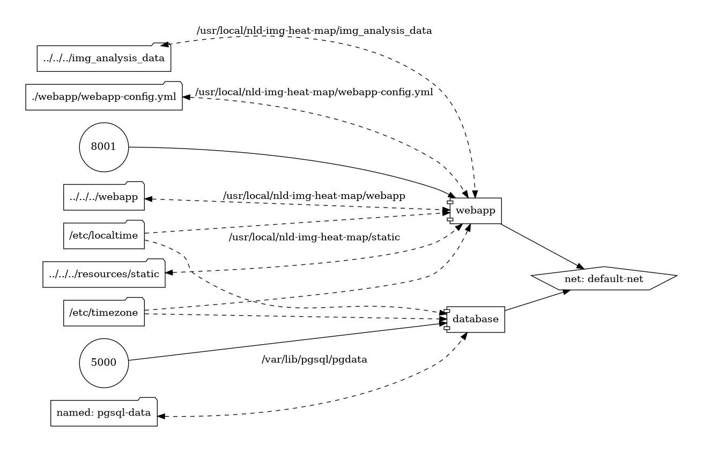

# 1. NLD :: Image Analysis API


Web service que fornece uma API RESTful para a inspeção e análise de imagens, no contexto de segurança patrimonial.

## 1.1. TOC

- [1. NLD :: Image Analysis API](#1-nld--image-analysis-api)
  - [1.1. TOC](#11-toc)
  - [1.2. Preliminares](#12-preliminares)
  - [1.3. O projeto](#13-o-projeto)
    - [1.3.1. Topologia](#131-topologia)
      - [1.3.1.1. Infraestrutura Docker](#1311-infraestrutura-docker)
      - [1.3.1.2. Aplicação FastAPI](#1312-aplicação-fastapi)
      - [1.3.1.3. Automação do projeto](#1313-automação-do-projeto)
    - [1.3.2. Ambientes](#132-ambientes)
      - [1.3.2.1. Desenvolvimento](#1321-desenvolvimento)
  - [1.4. Manipulação do projeto](#14-manipulação-do-projeto)
    - [1.4.1. Startup](#141-startup)
      - [1.4.1.1. Desenvolvimento](#1411-desenvolvimento)
    - [1.4.2. Shutdown](#142-shutdown)
  - [1.5. O que deseja fazer?](#15-o-que-deseja-fazer)


## 1.2. Preliminares

Esse projeto foi desenvolvido utilizando as seguintes ferramentas:


- Python, versão 3.12.9 ou superior; 
- UV Package Manager: Consome os arquivos [`pyproject.toml`](./pyproject.toml) e [`uv.lock`](./uv.lock) para instalar as dependências. Instruções para a instalação do gerenciador encontram-se [aqui](https://docs.astral.sh/uv/getting-started/installation/).
- [Docker Engine](https://docs.docker.com/engine/install/ubuntu/): v28.0.1 ou superior:
    - [Comando `docker` sem ser `sudo`](https://docs.docker.com/engine/install/linux-postinstall/). Opcional;
- [Docker Compose](https://docs.docker.com/compose/install/linux/): v2.29.7-desktop.1 ou superior;
- [GNU Make](https://www.gnu.org/software/make/): v4.3 ou superior.


Com o UV devidamente instalado e configurado, deverão ser instaladas as dependências da aplicação Python. Na raíz do projeto, executar:

- Construção do ambiente virtual:
```bash
uv python install 3.12.9
uv venv
```

- Activating the local environment (optional):
```bash
source .venv/bin/activate
```

- Instalando packages:
```bash
uv pip install -r pyproject.toml
```

## 1.3. O projeto

### 1.3.1. Topologia

#### 1.3.1.1. Infraestrutura Docker

```bash
./infra
└── docker
    └── develop                             # Infra do ambiente de desenvolvimento
        ├── webapp                          # Web service FastAPO
        ├── database                        # Serviço PostgreSQl
        └── docker-compose-dev.yml          # Declaração dos serviços
```

#### 1.3.1.2. Aplicação FastAPI

```bash
./webapp
├── __init__.py
├── common                                  # Package contendo módulos compartilhados entre as outras packages
├── core                                    # Package contendo módulos que constituem o cerne da aplicação FastAPI
├── main.py                                 # Módulo contendo o ponto de execução da aplicação FastAPI, via Uvicorn
├── modules                                 # Package que contém as implementações dos domínios da aplicação, i.e. análise de imagens e usuários
└── server                                  # Package que contém os módulos para a construção do servidor de aplicação (DB, DI, e a aplicação propriamente dita)
```

#### 1.3.1.3. Automação do projeto

```bash
.
├── scripts                                 # Scripts consumidos pelo Makefile
├── Makefile                                # Configuração dos scripts executados pelo make
├── ruff.toml                               # Configuração do Ruff (formatação e linting de código, usando o Mypy)
├── pytest.ini                              # Configuração do pytest (prefixos e sufixos de módulos para testes automatizados)
├── .dive-ci.yaml                           # Configuração do modo CI da ferramenta Dive (análise de imagens Docker em modo passou/falhou)
├── .dive-ui.yaml                           # Configuração do modo UI da ferramenta Dive (análise de imagens Docker em detalhes)
├── pyproject.toml                          # Manifesto do projeto, criado pelo UV, contendo informações básicas e listagem de dependências
└── uv.lock                                 # Arquivo contendo as relações entre dependências e subdependências, assim como suas versões e wheels
```

Através do `make`, via scripts de automação do Docker Compose implementados em um [Makefile](./Makefile), na raíz do projeto. Para conferir a documentação de cada script, basta executar no terminal

```bash
make                                        # Sem nenhum comando, executa o fallback 'help'
make help                                   # Explicitamente, mostra a documentação
```

### 1.3.2. Ambientes

#### 1.3.2.1. Desenvolvimento

O ambiente de desenvolvimento, construído nesse repositório, foi pensado de forma a simular a integração entre os potenciais serviços distribuídos que podem compôr a platorma de software. O diagrama abaixo ilustra como se dá esta integração.

- Manifesto dos serviços para este ambiente: [`./infra/docker/develop/docker-compose-dev.yml`](./infra/docker/develop/docker-compose-dev.yml)

Abaixo uma representação diagramática dessa estrutura.

<details>
<summary>Topologia do projeto - DEV</summary>



</details>


Segue abaixo uma listagem das assinaturas de URL, para as diferentes redes:

<table>
    <thead>
        <tr>
            <th>Serviço</th>
            <th>descrição</th>
            <th>Protocolos</th>
            <th>URL externa</th>
            <th>URL interna</th>
        </tr>
    </thead>
    <tbody>
        <tr>
            <td>webapp</td>
            <td>Aplicação FastAPI, que fornece a API RESTful</td>
            <td>TCP,HTTP</td>
            <td>http://localhost:8001</td>
            <td>http://webapp:8001</td>
        </tr>
        <tr>
            <td>database</td>
            <td>Servidor de banco de dados PostgreSQL</td>
            <td>TCP,HTTP</td>
            <td>http://localhost:5000</td>
            <td>http://database:5000</td>
        </tr>
    </tbody>
</table>

> [!IMPORTANT]
> - Concernindo as URLs supracitadas, as **externas** são classificadas assim pois são **externas à rede do Docker**, e.g. quando a aplicação FastAPI está sendo rodada localmente na máquina.
> - Similarmente, uma URL é dita **interna** pois é **interna à rede do Docker**, e.g. quando tanto a aplicação Spring Boot quanto o servidor MySQL estão rodando em seus conteineres, um se comunicando com o outro via TCP.

## 1.4. Manipulação do projeto

### 1.4.1. Startup

Na raíz do projeto, execute os seguintes comandos:

#### 1.4.1.1. Desenvolvimento

```bash
$ make build env=dev                # Realiza o build das imagens de todos os serviços, em ./infra/docker/develop/[nome-do-serviço]/Dockerfile
$ make start env=dev c=webapp       # Inicia a aplicação FastAPI, em modo detached (sem logs)
$ make start env=dev c=database     # Inicia o banco de dados PostgreSQL, em modo detached (sem logs)
```

> [!IMPORTANT]
> Para se certificar de que os conteineres foram de fato devidamente iniciados e na escuta das portas corretas, basta executar o comando `make ps env=[dev | prod]`.
> Para ver os logs de um conteiner específico, execute `make logs env=[dev | prod] c=[nome-do-serviço]`.

### 1.4.2. Shutdown

Similarmente, para ambos os ambientes, de modo a encerrar a execução de todos os contêineres, basta rodar:

```bash
make stop env=[dev | prod]          # Interrompe todos os contêineres para um ambiente
make clean env=[dev | prod]         # Opcional. Remove os contêineres e a network associadas aos serviços do ambiente
```

---

## 1.5. O que deseja fazer?

- [Voltar para TOC](#11-toc)
